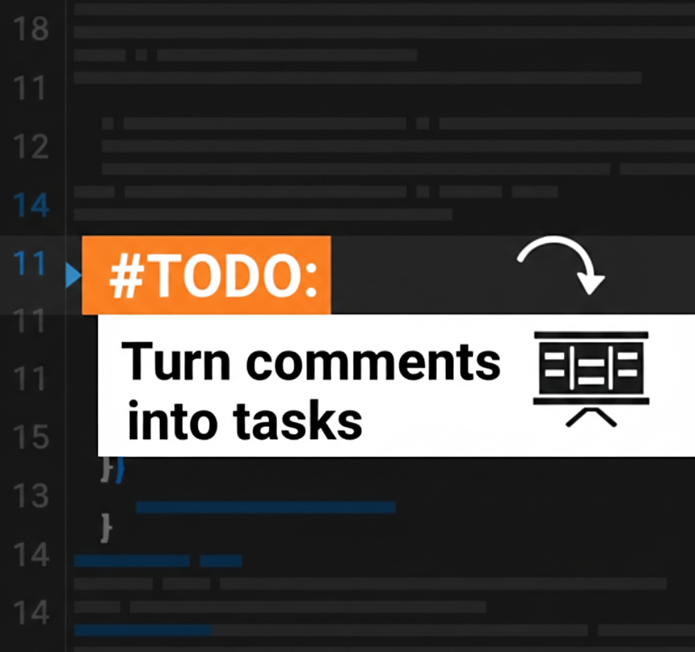

#  CodeQueue

**Turn your code comments into tracked work.**

CodeQueue automatically syncs your `// TODO` comments to your project management system of choice. Stay in the flow of coding while ensuring every task is captured, tracked, and organized.

---

## Features

- **🔄 Auto-Sync**: Automatically detects `// TODO` comments in your code and creates tasks in your chosen provider.
- **📍 Smart Linking**: Tracks tasks by file and content. Moving code around won't duplicate tasks.
- **🗑️ Auto-Archive**: Deleting a `TODO` comment automatically archives the corresponding item.
- **🏷️ Custom Status**: Configure which column/list new tasks should land in.
- **🔌 Multiple Providers**: Support for GitHub Projects, Apple Reminders, and Trello.
- **👥 Multi-Project**: Easily switch between different project boards.

## Supported Providers

### GitHub Projects (V2)

- Full project board integration
- Custom status columns
- Priority mapping
- Draft issues

### Apple Reminders (macOS only)

- Native macOS integration
- List-based organization
- Due date support

### Trello

- Board and list support
- Card creation and archiving
- Customizable default lists

## Setup

1.  **Install CodeQueue** from the VS Code Marketplace.
2.  **Select Provider**:
    - Open VS Code Settings (`Cmd+,` or `Ctrl+,`)
    - Search for "CodeQueue Provider"
    - Select your preferred provider from the dropdown: `GitHub`, `Apple Reminders`, or `Trello`

### GitHub Setup

3.  **Set GitHub Token**:
    - Click the `$(alert) CodeQueue: Setup GitHub Projects` status bar item.
    - Or run command: `CodeQueue: Set GitHub Token`.
    - _Note: Requires a Classic Personal Access Token (PAT) with `project` and `repo` scopes._
4.  **Connect Project**:
    - Click the status bar item or run `CodeQueue: Set Project ID`.
    - Select your GitHub Project from the list.
5.  **Set Default Status** (Optional):
    - Run `CodeQueue: Set Default Status` to choose where new tasks appear.

### Apple Reminders Setup

3.  **Select List**:
    - Run `CodeQueue: Set Project ID`.
    - Select your Reminders list from the dropdown.
    - _Note: VS Code needs permission to access Reminders in macOS System Settings._

### Trello Setup

3.  **Set Trello Credentials**:
    - Run `CodeQueue: Set GitHub Token` (it will prompt for Trello credentials).
    - Get your API Key from [https://trello.com/app-key](https://trello.com/app-key)
    - Generate a token from the same page.
4.  **Connect Board**:
    - Run `CodeQueue: Set Project ID`.
    - Select your Trello board from the list.
5.  **Set Default List**:
    - Run `CodeQueue: Set Default Status`.
    - Select which list new cards should be added to.

## Usage

Just write comments as you normally would:

```typescript
// TODO: Refactor the authentication service
// TODO(bug): Fix the race condition in the scanner
```

CodeQueue handles the rest.

- A spinner `$(sync~spin)` in the status bar indicates when sync is in progress.
- Check the "CodeQueue" Output channel for detailed logs.

## Requirements

- VS Code `^1.104.0`
- Provider-specific requirements:
  - **GitHub**: Personal Access Token with project access
  - **Apple Reminders**: macOS with Reminders access permission
  - **Trello**: API Key and Token

## Roadmap

We are planning to expand CodeQueue to support more project management tools:

- [ ] Linear
- [ ] Notion
- [ ] ClickUp
- [x] Trello

## Contributing

Contributions are welcome! If you're interested in adding support for one of the platforms above or have other improvements in mind, please feel free to open a Pull Request or Issue.

## License

[MIT](LICENSE)
